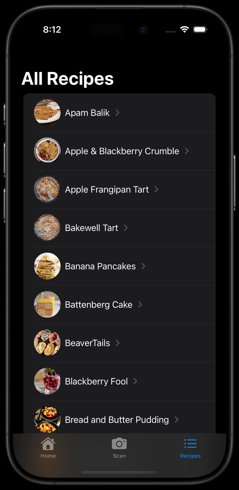

# RecipeApp

### Summary:
This Recipes app focuses on locating and accessing recipes quickly. The home page will recommend recipes based on your preference and based on the ingredients you have available. This first prototype focuses on the layout of the app. Organizing the views and page layouts. The Recipes app aims to bring you your favorite recipes while also providing you some new ones you may not have tried before.

Additional features:
	Some ideas I came up with was a recipe app that recommends meals to you based on ingredients you may already have, time to make, and difficulty. Next I asked, how can this be done? 
	For the ingredients, we can use computer vision and machine learning to identify the food items in the fridge and recommend a recipe based on those items. I have some familiarity with machine learning so I know we can train a model using CreateML and integrate it so the app uses the iPhone’s camera to take a photo and then the model will classify those items and return the labels. But this was way beyond the scope of the task.
	For time to make, we would need to find a way to gather this data. It could be from the recipe data, given to us or we can average out based on the amount of ingredients needed and kitchen tool requirements. This also could be added to the API later.
	And then for difficulty, we can base this off the average prep time and steps from the recipe. This will need to be added at a later time.

  ### App Preview:
  Home screen:
  

  List view:
  

  Detail view:
  

  
______________________________________________________________________________________
### Focus Areas:
  For this app I focused on the core requirements; show the name, photo and cuisine type. From there I took a look into the JSON keys and values to see what is given and how the data is presented. After that I began to sketch out a design layout and flow of the app.

  I wanted to think how the data can be presented and what tabs are needed in order to present the views. Keeping the main objective in mind, I asked myself what would make this app enjoyable or what value can I bring to the table (pun intended) that sets it apart from the rest. Why would someone want to open this app versus searching on the web for recipes?

  After I had my sketch done, I started to build out the basic structure of the app and how I wanted the app to flow. I wanted the home tab to show a few recipes to get the user a quick taste of what’s available. I wanted the list tab to show all the recipes and when you tap on one you can get more details about that specific recipe. Links to the recipe’s media (source site & video) will be added here to see more. 

  Then I integrated the JSON data and made some updates on the view based on how the images and text lengths looked. After that I went and thought about some additional UI enhancements, something that made it look different than the rest but natural to the Apple platform. 

________________________________________________________________________________________
### Time Spent:
  I spent about 4-5 hours over the span of two days. An additional 2 hours to gather screenshots and records. I made sure to focus on covering the basics and every time I thought about adding something I thought to myself, would this enhance the basic requirements? How long will this take? Can this be added in a later update?
	
 I would love to have more time but essentially I had to pick a point where I said, this is what I have so far and send it off for feedback. I tend to pick a point to pause and gather feedback because then I can see where I may need to focus more time on, what can be removed or what else can be added.

________________________________________________________________________________________ 
### Trade-offs and Decisions:
  I would have liked to created custom views that could have been used throughout the codebase but due to time, I created them using HStacks and VStacks. I also called the getRecipeData() in the SwiftUI view which won’t scale well.
	
 I also would have liked to taken more time to think about the layout and how the views look. I could have also picked a color scheme to use throughout the app, that way the look is more consistent.

________________________________________________________________________________________ 
### Weakest Part of the Project:
  It would be the way I’m fetching the recipe data inside the views. This definitely will need to be refractor so it can be separated from the views. Also, I am manually decoding the JSON data each time and I’m sure there is a better way to do this. I will look into this more and learn how to make this better and what are the best practices. 
 ________________________________________________________________________________________
### Additional Information:
  I would have loved to add more audio & visual feedback such as animations and continue to clean up the views. I would have also loved to implement those additional features so it could help set it apart from the rest of the recipe apps. 
	
 Overall, I really enjoyed creating this and found myself really motivated to make this great. I also loved the challenge of focusing on a task and using what is given to me to make something that has potential to be something awesome. 
