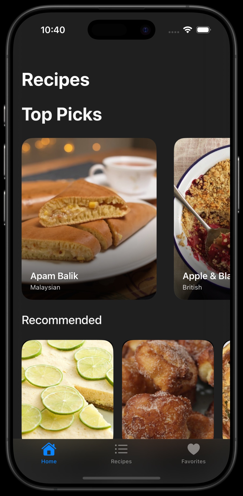

# RecipeApp

### Summary:
This Recipes app focuses on locating and accessing recipes quickly. The home page will recommend recipes based on your preference and based on the ingredients you have available. This first prototype focuses on the layout of the app. Organizing the views and page layouts. The Recipes app aims to bring you your favorite recipes while also providing you some new ones you may not have tried before.

## Version 1.0 update:

This update focuses on enhancing the UI/UX to resemble the **Apple Music app’s discovery and interaction model**. The goal was to elevate the experience of exploring and saving recipes through a clean, Apple-style interface with smooth navigation and engaging interactions.

---

## Key Improvements

### Apple Music Inspired Home View
- Redesigned the Home tab into modular horizontal carousels:
  - **Top Picks**
  - **Recommended**
  - **Cuisine-based sections**
- Layout mimics Apple Music’s editorial curation, encouraging exploration.

### Dynamic Favorites System
- Favorites now sync across all tabs (Home, List, Favorites).
- Add/remove from any screen — changes reflect instantly.
- Added a dedicated **Favorites tab** with swipe-to-remove support.

### Media Link Integration
- Each recipe detail includes external links:
  - Full recipe website
  - YouTube video walkthrough

### Pull-to-Refresh Support
- Users can **pull down on the Home tab** to refresh and fetch updated recipe data or image content.

### Real-Time Search
- Dynamic search added to the **Recipes tab**.
- Filters recipes as the user types, updating the list in real time.

### Clean SwiftUI Architecture
- Modular design using:
  - `@State`, `@Binding`, `@Namespace` for smooth animations and state sharing
  - A `stableID` fallback for consistent identification, even with incomplete API data

---

This revamp brings the app closer to a native Apple experience — focused on usability, clarity, and delightful interaction.

  ### App Preview:
  Home screen:

|  | |
|:--:|:--:|

  List view:
  
|  |  |
|:--:|:--:|

  Detail view:
  

  
______________________________________________________________________________________
